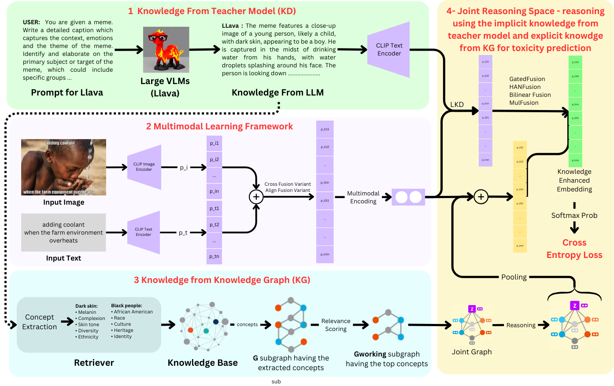

# Just KIDDIN' : Knowledge Infusion and Distillation for Detection of INdecent memes

## Overview

This project addresses the challenge of toxicity identification in online multimodal environments, where understanding contextual connections across modalities, such as text and visuals, is crucial. The proposed framework leverages Knowledge Distillation (KD) from Large Visual Language Models (LVLMs) and knowledge infusion from external sources to improve the detection of toxic content in hateful memes.

## Model Architecture



## 1. Generation of LLaVA captions

LLaVA (Large Language and Vision Alignment) captions are generated from meme images and their corresponding OCR (Optical Character Recognition) captions. These captions help provide a semantic understanding of the meme’s context, which is critical for identifying toxic content.

- **Script**: `LLaVa Generation/main.py`
- **Input**: Meme image and its OCR caption
- **Output**: LLaVA captions, which will be used in the following subgraph extraction steps.

<!-- - Generate LLaVA captions for a given meme, using the meme image and OCR caption. The code for the same is in the file `LLaVa Generation/main.py`  -->

## 2. Subgraph Extraction for KID-VLM

The subgraph extraction process is a key part of Knowledge Infusion. Nodes are extracted from the LLaVA-generated captions, expanded into knowledge graphs, and pruned to retain relevant nodes for model training.

### 2.1 Entity Extraction

To extract nodes (entities) from the LLaVA caption, we use keyword extraction techniques. This requires the following files

- **Script**: `Entity Extraction/grounding2.py`
- **Input**: Generated LLaVA caption
- **Required Files**: `Entity Extraction/concept.txt` for ConceptNet Knowledge Graph and `Entity Extraction/matcher_patterns.json` for the matcher patterns
- **Output**: Extracted Set of Nodes

### 2.2 Graph Expansion

Once the initial nodes are extracted, the graph is expanded by adding surrounding nodes from the ConceptNet Knowledge Graph. The expansion can include nodes at Hop 1 or Hop 2, depending on the requirement.

- **Script**: `RelKMG/parse_w_caption.py`
- **Input**: Previously Extracted Nodes
- **Output**: Expanded Sub-graph

### 2.3 Relevancy Scoring and Pruning

After expanding the graph, use a relevancy scoring mechanism to prune the graph and retain only the most important nodes (top 750, 500, or 250 nodes) based on relevance to the meme context.

- **Script**: `RelKMG/RelScoreMiniLM.py`
- **Input**: Expanded Subgraph
- **Output**: Pruned set of Nodes

### 2.4 Graph Contruction 

Use the **TranSE node embeddings** to embed the nodes into a low-dimensional space, and construct the final pruned subgraph, which will be used in the training process.

- **Script**: `makeGraphs.py`
- **Input**: Pruned Nodes
- **Required Files**: `glove.transe.sgd.ent.npy` to get the TranSE node embedding for the Knowledge Graph and `Entity Extraction/concept.txt` to get the Knowledge Graph
- **Output**: Final graph to be used

## 3. KID-VLM

### 3.1 Hateful Memes Dataset

To train the model on the Hateful Memes Dataset, use the following script. This will train the KID-VLM model and log results on Weights and Biases (WandB). You will need to log in to WandB and set up a database for Optuna hyperparameter optimization.

- **Script**: `hateclipperModel_rgcn_caption_llava_distil.py`

### 3.2 HarMeme Dataset

For the HarMeme Dataset, follow the subgraph extraction pipeline described above, and run the following scripts for each target variable (Intensity and Target)

- **Script**: `HarMeme/hateclipperModel_rgcn_lava_capt_distil_intensity.py` for Intensity variable and `HarMeme/hateclipperModel_rgcn_lava_capt_distil_target.py` for Target variable


Please cite our work as 

```

@article{garg2024just,
  title={Just KIDDIN: Knowledge Infusion and Distillation for Detection of INdecent Memes},
  author={Garg, Rahul and Padhi, Trilok and Jain, Hemang and Kursuncu, Ugur and Kumaraguru, Ponnurangam},
  journal={arXiv preprint arXiv:2411.12174},
  year={2024}
}

```
